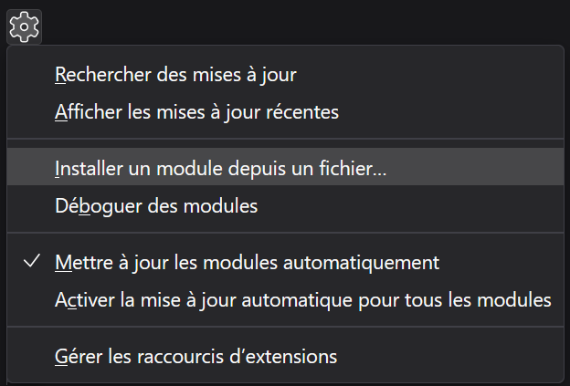
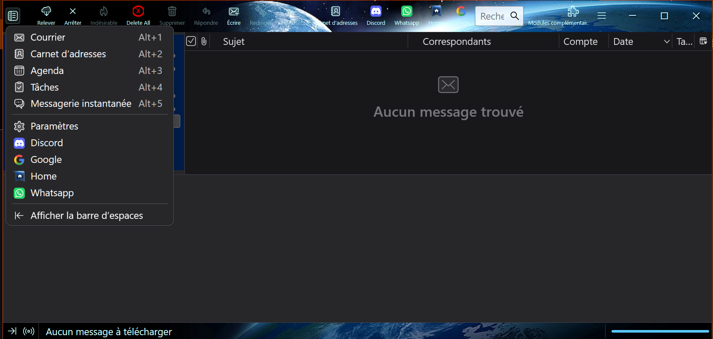

Extensions thunderbird 

## Pour ajouter des boutons dans la barre d outils et dans la barre d espaces
- ouvrir google dans un nouvel onglet
- ouvrir discord dans un nouvel onglet
- ouvrir whatsapp dans un nouvel onglet

## Pour ajouter un bouton dans la barre d outils
- selectionner tous les messages dans le dossier actuel et les supprimer
 
## Installation
Paramètres -> Modules complémentaire -> La roue dentée -> Installer un module depuis un fichier...

Choisir un fichier zip

 
## Basé sur
https://github.com/tdmrhn/Thunderbird-Quick-Access-Buttons/

# Screenhots

